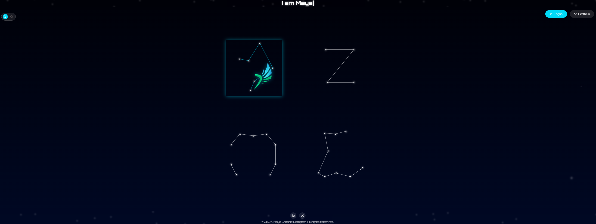

<h1 align="center"> 
   
    </img>
   
    Maya's website
   
</h1>

<h2 align="center"> 
  Discover her projects across different constellations
</h2>

  

  

  

  

## 📜 Description
Maya is a graphic designer and artist who wants to showcase her work in a unique way.
Specialized in digital marketing and branding, you can find her on:
- [Behance](https://www.behance.net/mayagozovezova)
- [LinkedIn](https://www.linkedin.com/in/mayagozel-ovezova-46655a211/)

## 🪐🌌 Constellations
- [X] **Phearion**: A constellation of the Phearion organization, making bots and tools to help students.
- [X] **Xonic**: A constellation of the Xonic brand (fictional), a brand that makes high-quality headphones.
- [X] **Big Brain**: A constellation of the Big Brain project, an AI assistant for students.

`more constellations coming soon...`