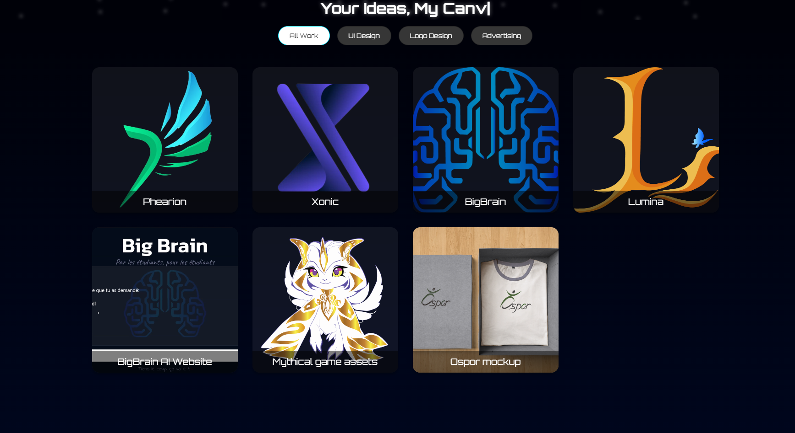
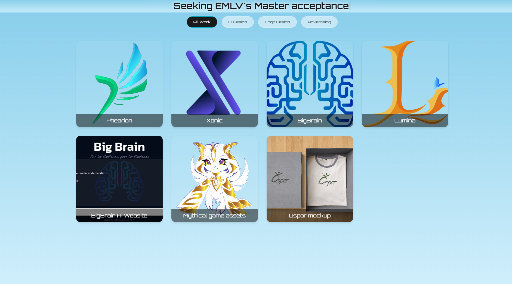

<h1 align="center">
   
    
   
    <a href="https://maya-design.cloud/">Maya's Website</a>
   
</h1>

<h2 align="center">
  Discover her projects across different constellations
</h2>

  
  
  
  

## 📜 Description
Maya is a graphic designer and artist who wants to showcase her work in a unique way. Specialized in digital marketing and branding, you can find her on:
- [Behance](https://www.behance.net/mayagozovezova)
- [LinkedIn](https://www.linkedin.com/in/mayagozel-ovezova-46655a211/)

## 🌗 Theme Previews
### Dark Theme

### Light Theme

## 🪐🌌 Constellations
- **Phearion**: A constellation of the Phearion organization, making bots and tools to help students.
- **Xonic**: A constellation of the Xonic brand (fictional), a brand that makes high-quality headphones.
- **Big Brain**: A constellation of the Big Brain project, an AI assistant for students.
- **More**: explore your  self: [Maya's Website](https://maya-design.eu/)

`more constellations coming soon...`

### 📄 License
Distributed under the MIT License. See LICENSE for more information.

### 📧 Contact
Maya Gozel Ovezova - LinkedIn: [Maya Gozel Ovezova](https://www.linkedin.com/in/mayagozel-ovezova-46655a211/)